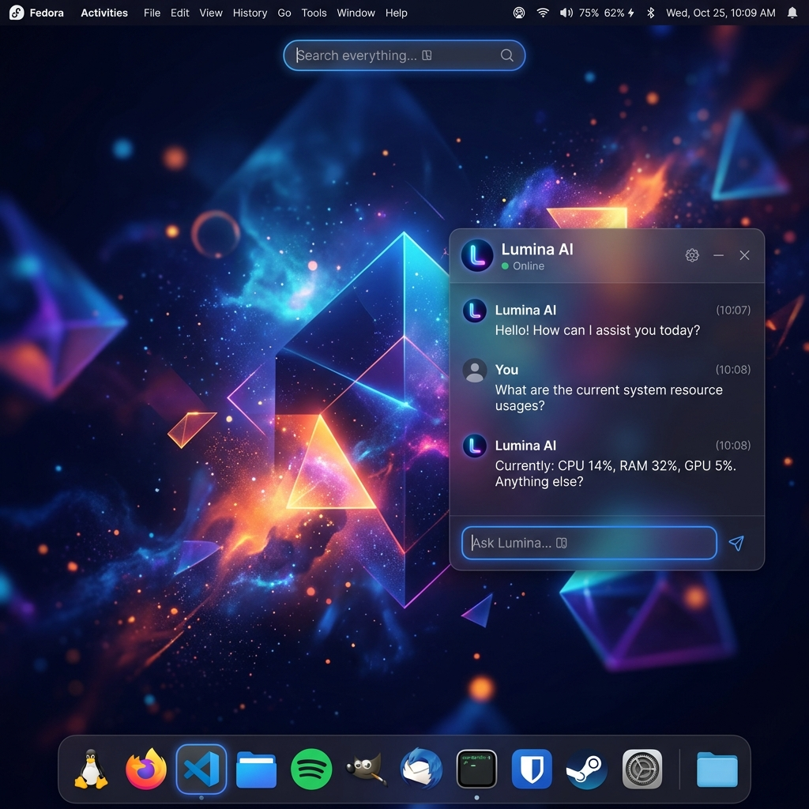

  <h1>(ToT) Ulo Linux</h1>
  
<strong>A hyper-modern, AI-integrated operating system designed for bare-metal performance.</strong>

  
  

---

## 🌟 Welcome to Ulo Linux

Ulo Linux is a lightweight, ultra-compatible, and premium Linux distribution built on the bedrock of Ubuntu 22.04 LTS. It strips away the bloat and injects modern cloud-AI paradigms directly into the desktop experience.

  
  
  
<em>(Left) The Premium Ulo Desktop &nbsp; &nbsp; &nbsp; (Right) The AI-Powered Ulo Assistant</em>

Whether you're running it as a Live USB on a ThinkPad or daily-driving it on a high-end desktop, Ulo Linux provides a flawless out-of-the-box experience.

### ✨ Core Features
* 🧠 **Ulo Assistant:** A system-level, Google Gemini-powered AI assistant that can execute bash commands and control your OS. Just hit `Ctrl + Space`!
* 🎨 **Premium Aesthetics:** Mint-Y-Dark styling with Cinnamon, offering a stable, non-intrusive, and beautiful traditional desktop metaphor.
* 💻 **Ultimate OEM Hardware Compatibility:** Built-in drivers for Lenovo ThinkPads (`tp-smapi`, `acpi-call`), Dell (`smbios-utils`), MacBooks (`mbpfan`), and seamless UEFI/BIOS updates via `fwupd`.
* ⚡ **Lightning Fast:** Fully debloated. No Snapd overhead.

---

## 📥 Download & Installation

The latest ISO image is compiled automatically in the cloud.

### 1. Download the ISO
👉 [**Download the Latest Ulo Linux ISO**](https://github.com/Aqua-code750/ulo-linux/releases/latest)

> [!NOTE]
> Because GitHub has a 2GB file limit, the ISO is split into 3 parts (`partaa`, `partab`, `partac`). 
> **How to join them:**
> - **Windows:** Open Command Prompt and run: `copy /b ulo-linux.iso.part* ulo-linux.iso`
> - **Linux/Mac:** Open Terminal and run: `cat ulo-linux.iso.part* > ulo-linux.iso`

*(Note: Ulo Linux also compiles experimental ARM64 Mobile RootFS tarballs for embedded developers!)*

### 2. Create a Bootable USB
1. Download a flashing tool like [Rufus](https://rufus.ie/) (Windows) or [BalenaEtcher](https://balena.io/etcher/) (Mac/Linux).
2. Insert a USB flash drive (8GB or larger).
3. Select the Ulo Linux `.iso` file and flash it to the drive.

### 3. Boot and Install
1. Restart your computer and boot from the USB drive.
2. Experience Ulo Linux directly from the USB! 
3. Ready to commit? Double-click the **Install Ulo Linux** icon on the desktop to launch the beautiful Calamares installer and permanently install it to your hard drive.

---

## 🛠️ Building from Source

Ulo Linux is built completely via GitHub Actions using Debian `live-build`. If you want to fork this project and build it yourself:

1. Fork this repository.
2. Go to the **Actions** tab and enable workflows.
3. Click **Run Workflow** on the `Build Ulo Linux (Ubuntu Base)` action.
4. GitHub will spin up an isolated runner, fetch all the packages listed in `config/package-lists/ulo.list.chroot`, compile the Electron apps, and output a fresh `.iso` in 15 minutes!

---

*Created by Aqua-code750*
*Note: the real ui/ux is not real compared to the screenshot it is a mock screenshot*
